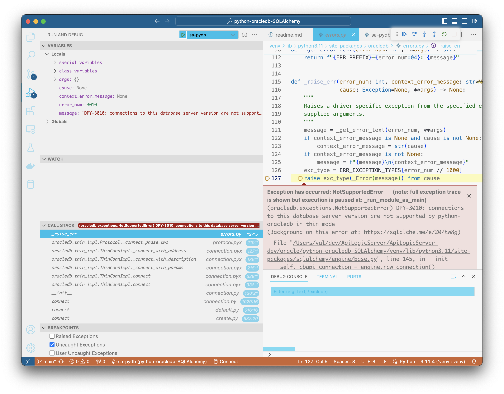

This project explores accessing oracle 19c via SQLAlchemy, using oracledb.

It is based on [this article](https://medium.com/oracledevs/using-the-development-branch-of-sqlalchemy-2-0-with-python-oracledb-d6e89090899c).

The article provides the [following sample code](https://github.com/cjbj/python-oracledb-demos-2022/blob/main/6_sqlalchemy_example.py).

These instructions were run on an AMD-series Mac, **ONLY**.

&nbsp;

## Install and test

### Setup venv

Setup your venv...

```bash title="Install API Logic Server in a Virtual Environment"
python -m venv venv                        # may require python3 -m venv venv
venv\Scripts\activate                      # mac/linux: source venv/bin/activate
python -m pip install -r requirements.txt  # accept "new Virtual environment"
```

Version information from `pip freeze`:

```log
cffi==1.15.1
cryptography==41.0.3
greenlet==2.0.2
oracledb==1.4.1
pycparser==2.21
SQLAlchemy==2.0.15
typing_extensions==4.7.1
```

&nbsp;

### Start Oracle

Use `oracleinanutshell/oracle-xe-11g`:
```bash
docker run -d --rm -p 1521:1521 --name=Oracle-11g --platform linux/amd64 -e ORACLE_SID=ORCL -e ORACLE_ALLOW_REMOTE=true oracleinanutshell/oracle-xe-11g
```

&nbsp;

### SQL Command Line

```bash
docker run --rm --name=sqlplus --platform linux/amd64 --interactive guywithnose/sqlplus sqlplus system/oracle@//10.0.0.234:1521
```

user/pwd = system/oracle

service seems to be XE.

```sql
-- list schemas

select * from all_users;

alter session set current_schema = HR;

SELECT table_name FROM all_tables WHERE owner = 'HR';

-- determone service

-- not: select sys_context('userenv','sessionid') Session_ID from dual;

select value from v$parameter where name like '%service_name%';
```

&nbsp;

### Run `sa-db`

Use Run Config sa-db.

#### Failures not reported


#### Thin Mode fails

If you enable line 28, thin mode fails with:



Research:

* [python-oracledb](https://github.com/oracle/python-oracledb/discussions/162)
    * Version 1.3.2 (worked for one thread participant) fails in the same manner
* [bug report](https://github.com/oracle/python-oracledb/issues/230)
* [thin mode claims support for Oracle Database 19](https://oracle.github.io/python-oracledb/#:~:text=Thin%20mode%3A%20Connects%20to%20Oracle,both%20older%20and%20newer%20databases)
    * *Thin mode: Connects to Oracle Database 12, 18, 19, 21 and 23.*

#### Thick Mode

Fails on thin, thick needs some lib.

&nbsp;

### Run `6_sqlalchemy_example`

Same failure is reported from [this sample](https://github.com/cjbj/python-oracledb-demos-2022/blob/main/6_sqlalchemy_example.py).

&nbsp;

## Appendix (old failed attempts - ignore for now)

### Image fails M-series


For an M-series mac:

```bash
docker run --name oracle-19c --platform linux/amd64 -p 1521:1521 -e ORACLE_SID=ORCL -e ORACLE_PWD=tiger -v ~/dev/ApiLogicServer/ApiLogicServer-dev/oracle/oracle-19c/oradata/:/opt/oracle/oradata doctorkirk/oracle-19c 
```

For amd architectures:
```bash
docker run --name oracle-19c -p 1521:1521 -e ORACLE_SID=ORCL -e ORACLE_PWD=tiger -v /Users/val/dev/ApiLogicServer/ApiLogicServer-dev/oracle/oracle-19c/oradata/:/opt/oracle/oradata doctorkirk/oracle-19c 
```

#### Fails - no services

**Set up Oracle Volume**

```bash
cd ~/dev/ApiLogicServer/ApiLogicServer-dev/oracle
mkdir oracle-19c
chmod -R 755 oracle-19c
```


Failing with [docker image](https://registry.hub.docker.com/r/doctorkirk/oracle-19c): a *SingleInstance-NonCDB* server.

The log indicates the database failed to start, *listener supports no services*:

```log
(venv) val@Vals-MPB-14 python-oracledb-SQLAlchemy % docker run --name oracle-19c --platform linux/amd64 -p 1521:1521 -e ORACLE_SID=ORCL -e ORACLE_PWD=tiger -v ~/dev/ApiLogicServer/ApiLogicServer-dev/oracle/oracle-19c/oradata/:/opt/oracle/oradata doctorkirk/oracle-19c
cat: /sys/fs/cgroup/memory/memory.limit_in_bytes: No such file or directory
cat: /sys/fs/cgroup/memory/memory.limit_in_bytes: No such file or directory
/opt/oracle/runOracle.sh: line 102: [: -lt: unary operator expected
ORACLE PASSWORD FOR SYS, SYSTEM AND PDBADMIN: tiger

LSNRCTL for Linux: Version 19.0.0.0.0 - Production on 14-SEP-2023 02:20:04

Copyright (c) 1991, 2020, Oracle.  All rights reserved.

Starting /opt/oracle/product/19c/dbhome_1/bin/tnslsnr: please wait...

TNSLSNR for Linux: Version 19.0.0.0.0 - Production
System parameter file is /opt/oracle/product/19c/dbhome_1/network/admin/listener.ora
Log messages written to /opt/oracle/diag/tnslsnr/211e1d9eee03/listener/alert/log.xml
Listening on: (DESCRIPTION=(ADDRESS=(PROTOCOL=ipc)(KEY=EXTPROC1)))
Listening on: (DESCRIPTION=(ADDRESS=(PROTOCOL=tcp)(HOST=0.0.0.0)(PORT=1521)))

Connecting to (DESCRIPTION=(ADDRESS=(PROTOCOL=IPC)(KEY=EXTPROC1)))
STATUS of the LISTENER
------------------------
Alias                     LISTENER
Version                   TNSLSNR for Linux: Version 19.0.0.0.0 - Production
Start Date                14-SEP-2023 02:20:04
Uptime                    0 days 0 hr. 0 min. 0 sec
Trace Level               off
Security                  ON: Local OS Authentication
SNMP                      OFF
Listener Parameter File   /opt/oracle/product/19c/dbhome_1/network/admin/listener.ora
Listener Log File         /opt/oracle/diag/tnslsnr/211e1d9eee03/listener/alert/log.xml
Listening Endpoints Summary...
  (DESCRIPTION=(ADDRESS=(PROTOCOL=ipc)(KEY=EXTPROC1)))
  (DESCRIPTION=(ADDRESS=(PROTOCOL=tcp)(HOST=0.0.0.0)(PORT=1521)))
The listener supports no services
The command completed successfully
```


&nbsp;

### Use sqlplus

In Docker desktop, click the image and open terminal, and enter `sqlplus`.
Fails to login with user (scott, SYS, SYSTEM) and pwd `tiger`:

```log
ORA-12547: TNS:lost contact
```

Database log contains:
```log
The listener supports no services
```

Some suggestions in [this article](https://ittutorial.org/the-listener-supports-no-services-alter-system-set-local_listener/).


```bash
sh-4.2$ lsnrctl status listener

LSNRCTL for Linux: Version 19.0.0.0.0 - Production on 14-SEP-2023 01:52:04

Copyright (c) 1991, 2020, Oracle.  All rights reserved.

Connecting to (DESCRIPTION=(ADDRESS=(PROTOCOL=IPC)(KEY=EXTPROC1)))
STATUS of the LISTENER
------------------------
Alias                     LISTENER
Version                   TNSLSNR for Linux: Version 19.0.0.0.0 - Production
Start Date                14-SEP-2023 01:19:47
Uptime                    0 days 0 hr. 32 min. 17 sec
Trace Level               off
Security                  ON: Local OS Authentication
SNMP                      OFF
Listener Parameter File   /opt/oracle/product/19c/dbhome_1/network/admin/listener.ora
Listener Log File         /opt/oracle/diag/tnslsnr/1726a1dad864/listener/alert/log.xml
Listening Endpoints Summary...
  (DESCRIPTION=(ADDRESS=(PROTOCOL=ipc)(KEY=EXTPROC1)))
  (DESCRIPTION=(ADDRESS=(PROTOCOL=tcp)(HOST=0.0.0.0)(PORT=1521)))
The listener supports no services
The command completed successfully
```
